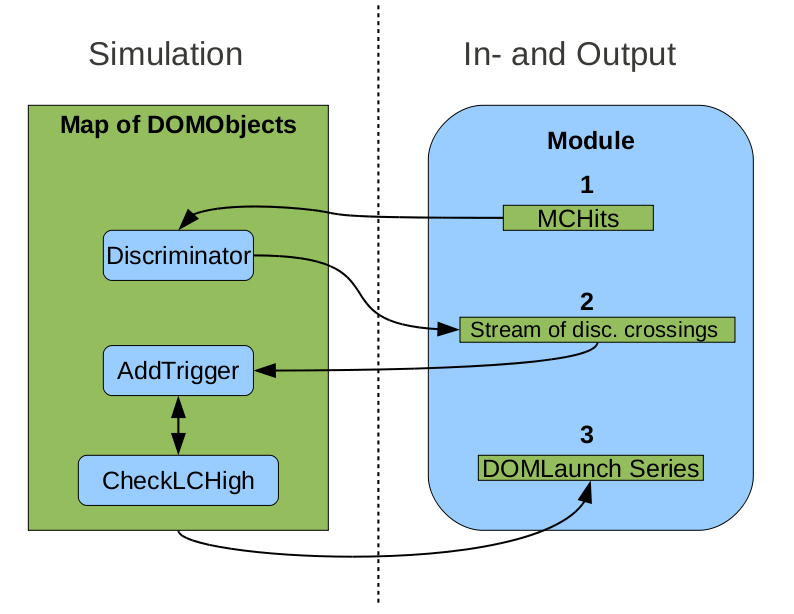
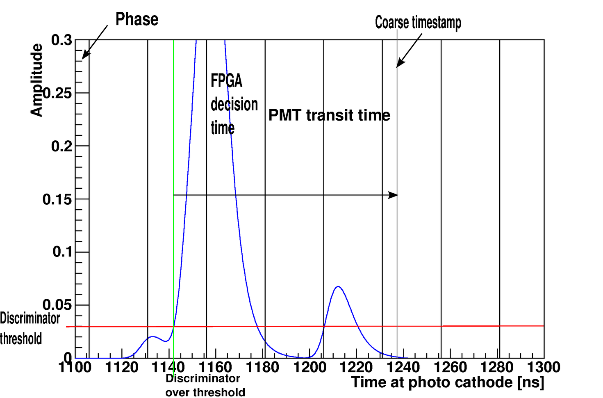

.. _DOMLauncher:

===========
DOMLauncher
===========

This module simulates the behavior of the DOM mainbaord, including launching and digitization. It
reads MCPulses, produced by PMTResponseSimulator, and outputs DOMLaunches. The simulation starts
effectively at the anode of the PMT with MCPulses processed by PMTResponseSimulator representing the
charge at the anode resulting from a photon hit. This signal is then propagated through the electronics
and logics of the DOM to simulate the generation of launches. There are three main features of the DOM that are
simulated to generate launches, namely:

#. Discriminator
#. Local Coincidence logic
#. Digitization

Launch decisions based on local coincidence conditions, while being governed by simple rules,
generates a complex behavior of the detector. Instead of working out how to handle all different cases
based on the entire detector one can model the detector as being built up by objects that follows some
rules which make them behave as real DOMs. This model is much simpler since only the communication and
the rules have to be implemented.

A schematic layout of the flow of data in DOMLauncher. What can be noticed is that the module only
handles the IO and the configuration of the DOMObjects, which is not shown in this scheme. MCPulses
are processed by the Discriminator() method of the DOMObjects and disc. crossings are put in a
global stream. This stream is then fed back to the DOMObjects which then simulate the LC-logic and by
the DOMObjects communicating with each other. Once the stream is empty the launches can be gathered from
the DOMObjects.

Discriminator
-------------

The DOMObjects base their decisions on discriminator threshold crossings. These are simulated with
the Discriminator() member function of the DOMObjects. Since the discriminator in a DOM runs independently
on the DOM, the discriminator threshold crossings are simulated for each
DOMObject for the entire frame. SPE pulse templates, retrieved from calibration, are used together with
the MCPulses to model the discriminator waveform. Each time the waveform crosses above a preset threshold it
creates a disc. crossing object which is put into the global stream of such crossings. Once all DOMs have
had their discriminators simulated the global stream is sorted so it becomes time ordered.

LC-logic
--------

The LC-logic simulation in DOMLauncher depends on the DOMObjects communicating with their neighbors,
following the same set of 'rules' as the real DOMs and that the DOMTriggers are fed back to the DOMObjects in
time order. Most of the 'rules' are given in the ICECUBE DOMAPP Firmware Timing Version 0.2 document but restated
here in a somewhat different format adapted to the DOMLauncher simulation.
The procedure is as follows: when a disc. crossing is received

#. Check if an LC signal has been sent to the neighbors the last 350 ns.

   * If true:  no action.
   * If false: Send signals to all connected neighbors.

#. Launch decision

   * If busy: throw away the disc. crossing.
   * If not busy

      * If no LC signal has been received: Put the disc. crossing in a list of potential launches list
      * If an LC signal has been received: Check if there are any potential launches from earlier disc. crossing
        and see if any of them are in i coincidence and decide what kind of launch (SLC, HLC) it will be.

When the DOMObject decides to launch it will not be able to make another launch for some time. i.e
it will be busy. The time it is busy depends on the type of launch and the availability of the digitizers.
Below follows a table containing the times needed for different operations contributing to the dead time of the
DOM and the ATWD chip.

+--------------------+---------+------------------------------------------------+-----------------------------------+
| Quantity           |Anotation| definition                                     |      value                        |
+====================+=========+================================================+===================================+
| ATWD Digitization  | Ad      | The time it takes to digitize one ATWD channel | 29000 [ns]                        |
+--------------------+---------+------------------------------------------------+-----------------------------------+
| ATWD Restart Time  | Ar      | The time it takes to restart the ATWD Chip     | 225 [ns]                          |
+--------------------+---------+------------------------------------------------+-----------------------------------+
| ATWD Clear Time    | Ac      | The time it takes to clear one ATWD channel    | 950 [ns]                          |
+--------------------+---------+------------------------------------------------+-----------------------------------+
| ATWD Restart Time  | Ar      | The time it takes to restart the ATWD Chip     | 225 [ns]                          |
+--------------------+---------+------------------------------------------------+-----------------------------------+
| Cable length corr  | CLr     | The longest time it takes to propagate an LC   | 1325 [ns]  (for in-ice lcspan = 2 |
|                    |         | signal from the furthest neighbor              | regular IceCube DOM)              |
+--------------------+---------+------------------------------------------------+-----------------------------------+
| Clock Cycle        | Cl      | The length of the FPGA clock cycle             | 25 [ns]                           |
+--------------------+---------+------------------------------------------------+-----------------------------------+
| Post window        | Pw      | The length of the FPGA clock cycle             | 1000 [ns]  (standard icecube)     |
+--------------------+---------+------------------------------------------------+-----------------------------------+

The table below shows how the dead time are computed for two kinds of launches and the ATWD chip. Note that there are
two ATWD chips on each DOM. Therefore a DOM can have two consecutive HLC launches with the second one starting only 2 clock
cycles after the first ended, but a third launch must happen at least 22.5 μ's

+--------------------+----------------------------------------------------------------+-----------------------------------+
| Time busy for      | definition                                                     | value [ns]                        |
+====================+================================================================+===================================+
| SLC Launch         | CLr + Pw + 5 * Cl                                              | 2450   (for in-ice lcspan = 2)    |
+--------------------+----------------------------------------------------------------+-----------------------------------+
| HLC Launch         | 256 fADC samples + 2 * Cl                                      | 6450                              |
+--------------------+----------------------------------------------------------------+-----------------------------------+
| ATWD Chip Dead Time| n * Ad + Ar + (4-n)*Ac (n being number of channels to digitize)| 4025 to 116225                    |
+--------------------+----------------------------------------------------------------+-----------------------------------+

Digitization
------------

ATWD and fADC digitization is in many ways similar to the discriminator sampling.
The difference though is that there is a fixed number of waveform samples to be evaluated, which are
digitized and stored, 128 samples for the ATWD and 256 for the fADC. The fADC's sampling
rate is fixed to the FPGA clock cycle while the ATWD has a programmable sampling rate which
needs in principle to be checked when simulated, even though the sampling rate has been the
same for several years.

The waveform is sampled at the end of each digitizer bin, meaning that
if the ATWD starts at time :math:`t=0` and the sampling rate corresponds to
a bin length 3.3 ns then the first wave form sample is at :math:`t=3.3` ns
and the next one at :math:`t=6.6` ns and so on. All delays affecting the
digitizer are applied directly when sampling the waveform. The sample
time is given by

.. math::

   t  = t_b -t_h - d_t +d_d

where :math:`t_b` is the bin time, :math:`t_h` is the time of the hit, :math:`d_t` the
whole transit time including the 75 ns delay line and :math:`d_d` is the
delta time associated with the different digitizers. When the waveform
is first sampled it is temporarily stored as an amplitude in mV with
double precision. Then the digitization procedure begins by relating
the voltage with digitizer counts still in double
precision. Electronic noise is added in counts sampled from a Gaussian
distribution centered at 0 with a variance of 0.8 counts for the
ATWD. Finally the baseline of the digitizer is added and the counts in
double precision are floored and stored as integers. For the ATWD each
bin has its unique baseline while the fADC, being a 5 bin long circle
buffer, has one nominal baseline for all bins. Furthermore the ATWD
digitization returns a true or false depends whether the counts
crossed the threshold, of 2/3 (being 768 counts) of the dynamic digitizer range. If the
ATWD returns true the digitization of the next ATWD channel with less
gain is initiated.

Simulated effects
-----------------
The following DOM behaviors and physics effects are simulated in DOMLauncher.

Electronic noise in the digitizers
^^^^^^^^^^^^^^^^^^^^^^^^^^^^^^^^^^
The electronic noise in the digitizers is added on top of the waveform in units of
counts. It is modeled by a Gaussian function with a mean = 0 and a variance of 0.8
counts for ATWD digitizers and 0.5 counts for the fADC digitizer. These values are
taken from the old DOMsimulator project.

Beacon launches (CPU triggered launches)
^^^^^^^^^^^^^^^^^^^^^^^^^^^^^^^^^^^^^^^^
Beacon launches are launches that are triggered by the internal CPU onboard the DOM.
These launches happen at a constant rate. In real data the rate of beacon launches
was 0.6 Hz for data up to the 2014 season and is now 1.2 Hz. Note that a beacon launch
is a full readout meaning that all three ATWD channels are read out and 6.4 :math:`\mu` s
of the fADC read out.

The rate at which beacon launches occur in the simulation can be set with the keyword::

    BeaconLaunchRate = 0.6*I3Units.hertz

for the DOMLauncher module. The BeaconLaunch keyword can be set to False to completely
omit the simulation of beacon launches.

The FPGA Clock phase
^^^^^^^^^^^^^^^^^^^^
Operations performed by the FPGA occur at a discrete times governed
by the clock frequency. The FPGA clock frequency is set to 40 MHz which means that
the clock cycle length is 25 ns. A DOM launch time will have this granularity of 25 ns.
The clock phase between DOMs varies (the global time at which a clock cycle begins for each DOM).
Therefore, a random clock phase is added to the clock cycle at each new frame.
However, there is also a small drift in the clock cycle, which is not simulated.
The effect of the drift should be negligible even for long frames (1 s long).
The shifting phase is instead simulated as a RAPcal time uncertainty, which is
discussed in the next section. 

RAPcal time uncertainty
^^^^^^^^^^^^^^^^^^^^^^^

Optimizations
-------------

This section will briefly describe the more complicated optimizations.

Hit Merging
^^^^^^^^^^^

The concept of pulse merging is applied in both DOMLauncher module and
PMTResponseSimulator module.
A merged pulse is an effective representation of the contributions from single
pulses in a time bin.
The charge of the merged pulse is the sum of all charge in the bin and the time
of the pulse is the charge weighted average time of all pulses in the bin.
In PMTResponseSimulator it is applied in a post processing step to reduce memory
resources and work load for the subsequent DOMLauncher module using a bin size
of 0.2 ns.
In the DOMLauncher module a much more aggressive pulse merging is performed
using a bin size of 50 ns.
However, it is only applied to pulses which are more than 200 ns in the past
while evaluating the waveform, "*i.e.*" pulses which are recovering from
droop.

Pulse Template Tabulation
^^^^^^^^^^^^^^^^^^^^^^^^^
The performance of evaluating pulse templates can be dramatically improved by
interpolating the pulse templates.
Since the pulse templates are well behaved with three distinct behaviors it was
decided to use three linear interpolations with different interpolation steps.
To cover the pulse, droop and the initial droop recovery ending at about 100 ns,
(depending on the digitizer and channel) a dense interpolation with
:math:`\approx 10` ps steps is used.
During the slower droop recovery up to 6.4 :math:`\mu` s a coarser step( around
5 ns) is used.

To account for droop correctly at a given time, the contribution from pulses far
in the past must be determined.
It was therefore important to interpolate the pulse templates far out in the
tails.
Since the pulse template falls off exponentially, the derivate has a similar behavior and thus
does not change much in the tail.
In order to save memory quadratic binning is applied on the interpolation of the
pulse template tail.

.. [DOMAPP_REPORT]  DOMAPP Firmware Timing Version 0.2 https://docushare.icecube.wisc.edu/dsweb/Get/Document-28424/DOMAPPtiming.pdf
.. [DAQ_PAPER]  The IceCube data acquisition system: Signal capture, digitization, and timestamping http://arxiv.org/abs/0810.4930
