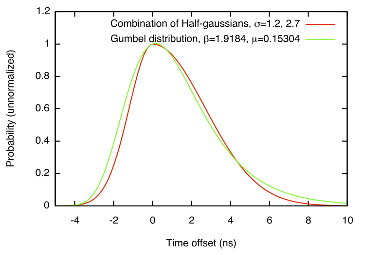
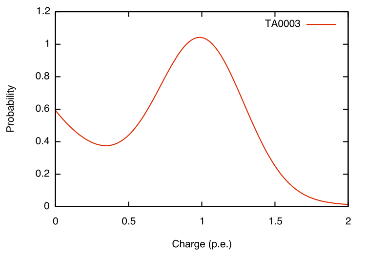

.. _PMTResponseSimulator:

====================
PMTResponseSimulator
====================

PMTResponseSimulator simulates the following effects:

Time Jitter
-----------

The amount of time for the photoelectron to traverse the PMT to the first dynode and for the electron shower to traverse the dynode chain can both vary. This is referred to as the "PMT jitter" or just "jitter". According to the PMT Paper [PMT_Paper]_ (page 17): "The main peak of the time histogram has width equivalent to a Gaussian of σ = 2.0 ns, although the rising and falling edges of the peak fit better to half-Gaussians with σ = 1.2 ns and 2.7 ns, respectively." We use a slightly different parameterization created by R. Porrata, using a Gumbel distribution, which is shown below:

SPE Charge Distribution
-----------------------

The amplification of photoelectrons by the PMT is also not constant. We use the "TA0003" [Charge_response_function]_ probability distribution model, which includes a gaussian component which peaks at 1 p.e. and an exponential component of small amplitude pulses:

Prepulses
---------
Lab measurements show small amplitude pulses at early times due to photons entering the PMT and producing photoelectrons from the fist dynode. These pulses are about 30 ns before the main body of normal photoelectron pulses, and have amplitudes which are between ten and twenty times smaller  (See section 10, page 33 and Figure 11 of [PMT_Paper]_).

In PMTResponseSimulator we take the (default) probability of an I3MCHit being a prepulse to be .003 and the weight to be 1/20 that of an ideal s.p.e. For the timing of prepulses we use a shift of -31.8 ns at a PMT operating voltage of 1345, which is then corrected by a factor proportional to the square root of the refernce voltage divided by the actual operating voltage, since the photoelectron acceleration is proportional to the voltage, and the prepulse time shift is controlled by the degree to which a photon can get ahead of a photoelectron. See [CWendtPrepulses]_ and [CWendtGhentTalk]_ for details of the lab measurements. 

Comments from Chris Wendt about Prepulse Charges
~~~~~~~~~~~~~~~~~~~~~~~~~~~~~~~~~~~~~~~~~~~~~~~~
In an email discussion Chris wrote:

	How to scale [the prepulse charge] with voltage is a question that has no measurement.  

	In the absence of a measurement, I tried to construct a plausible model: the gains at all the dynodes are varying in a certain way with voltage, except the first one has much higher gain than the rest due to higher voltage drop.  So like the other nine each have gain (1.5e8 / 25)**(1/9)=5.66 in my DOM study.  Then if the whole DOM gain scales with HV according to some standard domcal formula, that variation can be assigned also to the individual factors, but now the first dynode is almost 5.66^2 so it should get as much gain variation as two of the other dynodes.  So… if G/G0=(V/V0)^a and G=g_1*g_2*...*g_10=g^11 (g_1=g^2, g_2=g_3=...=g_10=g) then g/g0=(V/V0)^(a/11) and therefore g_1/g_1_0=(V/V0)^(2a/11) or maybe (V/V0)^(a/5).
	
He further noted that this was never implemented, since it has only been theorized, but that either way the effect is small. Still, this should perhaps be tried out at some point. 

Late Pulses
-----------
When a photoelectron scatters back from the first dynode it will take a short time to turn around and reach the dynode again, producing a late pulse. According to the PMT paper[PMT_Paper]_: "About 4% of hits are found in a shoulder (25–65 ns) and secondary peak at 71 ns, and 0.2% make up a corresponding tertiary structure (85–160 ns)." We simulate a (default) probability of .035 that a given pulse is a late pulse. Since late pulses are single photoelectrons arriving at the first dynode, just at a delayed time, they have a weight of one, subject to the usual SPE Charge Distribution. For the timing distribution we use the paramterization shown on `Late Pulse Data <https://wiki.icecube.wisc.edu/index.php/Late_Pulse_Data>`_.

Afterpulses
-----------
Photoelectrons passing through the PMT can ionize residual gas atoms, which then drift back to the photocathode (due to their positive charge) where they can dislodge several electrons, which are then amplified in the usual way by the dynode chain. According to the [PMT_Paper]_: "Up to primary pulses of 1 × 106 p.e., the integral from 300 ns to 11 μs corresponds to 0.06 SPE per primary photoelectron", we use a probability of 0.0593, but subject to SPE weighting, which reduces the charge on average. We use the timing distribution shown on `Afterpulse Data <https://wiki.icecube.wisc.edu/index.php/Afterpulse_Data>`_. Note also that we (incorrectly) simulate each afterpulse electron independently from distributions whose relative weights are enhanced by the bunch size, rather than simulating correlated bunches. Our parameterization of the charges of the early afterpulses is summarized on `https://wiki.icecube.wisc.edu/index.php/Early_Afterpulse_Data`_.

Saturation
----------
The current which the PMT can supply is limited, and as the illumination becomes strong its output departs from depending linearly on the input and approaches a constant. We use the parameterization described on `PMT saturation at low gain <https://wiki.icecube.wisc.edu/index.php/PMT_saturation_at_low_gain>`_ to convert ideal currents to visible output currents[#Sat_Hist]_.

TODO: Is there an actual reference for Tom F.'s parameterization constants besides the pmt-simulator source code?

Since PMTResponseSimulator deals only in I3MCHits, which are considered delta function impulses of charge, it is necessary to compute an approximate value of the ideal anode current to apply the saturation parameterization. This is done by convolving the series of I3MCHits with a simple current template, whose form is

.. math::

	I(t) = exp(|t|/tau)/(2*tau)

where tau is 2.2 ns. This particular template has the advantage that the convolution can be computed with a pair of very simple linear scans through the data, it is not intended to be especially physically meaningful. Once the ideal anode current is estimated at the time of a given hit, the ratio of the visible current after saturation to the ideal current is computed, and the weight of the hit is multiplied by this ratio.

Hit Merging
-----------
Hit merging is not an actual physics effect, it is actually an approximation which is supposed to reduce data size and computation time without affecting physics results. The optimization is to replace sequences of I3MCHits in very short time ranges with single I3MCHits, weighted to account for all of the original hits. When this merging is turned on (which it is by default when using the DOMLauncher.DetectorResponse segment) hits are merged within .2 ns, unless doing so would lose information about parent particles.

With or without hit merging, the output of PMTResponseSimulator is always time-ordered.

.. [PMT_Paper] Calibration and Characterization of the IceCube Photomultiplier Tube http://arxiv.org/abs/1002.2442v1
.. [Charge_response_function] https://wiki.icecube.wisc.edu/index.php/ROMEO_Charge_Response_Function#Charge_response_function
.. [Afterpulse_Paper] http://arxiv.org/abs/0911.5336v1
.. [#Sat_Hist] For more of the historical background of this model, see https://wiki.icecube.wisc.edu/index.php/IC79_Benchmark_Simulation_Validation#IceTop_.28Serap_and_Tom_F..29
.. [CWendtPrepulses] Chris Wendt's lab notes on prepulses: http://icecube.wisc.edu/~chwendt/prepulse-notes/
.. [CWendtGhentTalk] Chris Wendt's talk at the 2007 Ghent meeting on detialed PMT measurements: http://icecube.wisc.edu/~chwendt/talks/PMTChargeSpectrumVsTime-Ghent2007.pdf