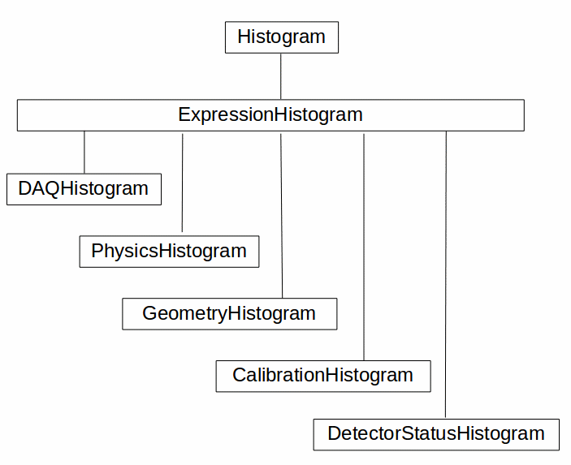

Introduction
============
The goal of the project is to provide lightweight histograms in production 
samples.  This project **only** generates the histograms.  Rendering and 
comparisons to benchmarks are the responsibility of another project.  

The focus is on simplicity and portability.

Overview
++++++++
All of the code is written in python 2.7 and there are no other dependencies. 

Very Broad Overview 
+++++++++++++++++++
The intended use for most people is going to be limited to adding histograms to production. 

This project currently consists of one I3Module:

* **ProductionHistogramModule** - This is the I3Module that you add to the end of your 
  chain and has only four parameters.  This module currently lives in 
  production-histograms/python/icetray_modules/production_histogram_module.py.

  - **Histograms** - A list of either Histogram or HistogramModule class objects or instances. 

  - **OutputFilename** - Name of the output pickle file, which contains the filled histograms.

  - **Prescales** - A dictionary with keys "Geometry", "Calibration", "DetectorStatus", "DAQ", and "Physics" whose data members (type int) are used to prescale the respective frames.

Usage
+++++

Producing Histograms
--------------------
The first thing you might want to do is run the ProductionHistogramModule on your sample.  
Simply add the following to your script and set the ''Histograms'' parameter accordingly.

.. code-block:: python

    from icecube.production_histograms import ProductionHistogramModule
    from somewhere import MyHistogram
    tray.AddModule( ProductionHistogramModule, Histograms = [MyHistogram] )        

The ''Histograms'' parameter takes a list of either class objects or instances of either Histograms or HistogramModules.

.. code-block:: python

    from icecube.production_histograms import ProductionHistogramModule
    from somewhere import MyHistogram
    my_histogram_instance = MyHistogram()
    my_histogram_instance.frame_key = "Foo"
    tray.AddModule( ProductionHistogramModule, Histograms = [my_histogram_instance] )        

Scripts
+++++++
There's currently one script for combining pickle files produced from a production 
run into a single pickle file that can be compared to benchmarks.

The script is ''production-histograms/resources/scripts/combine_pickle_files.py'' ::

 Usage: combine_pickle_files.py [options]
 
 Options:
   -h, --help            show this help message and exit
   -i INPATH, --inpath=INPATH
                         Path to input pickle files.
   -o OUTFILENAME, --output_pickle_filename=OUTFILENAME
                         Name of output file with combined histograms.

Examples
++++++++
There are currently a few example scripts that will run on files at different levels.  
They simply run the I3Reader on input I3File(s) and dumps histograms into an output pickle file.

* **trigger** - trigger_level_histograms.py
* **filter L1** - filter_level1_histograms.py
* **filter L2** - filter_level2_histograms.py

All have the same options. ::

 Options:
   -h, --help            show this help message and exit
   -i INFILES, --infiles=INFILES
                         Regex to pass to glob that specify the input files.
   -g GCDFN, --gcdfile=GCDFN
                         Input GCD file.
   -o OUTPUT_FN, --output-filename=OUTPUT_FN
                         Filename of the output pickle file.

Class Hierarchy
+++++++++++++++

            This is the histogram class hierarchy.
