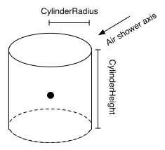
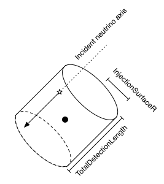

Event generator details
-----------------------

Some details of how each event generator works are necessary in order to fully
understand the weighting scheme.

dCORSIKA
^^^^^^^^

dCORSIKA (our private branch of the CORSIKA air shower simulation package) can
be run in one of two modes. In the "unweighted" mode, it generates primary
cosmic rays from proton through iron proportional to the spectrum from the
Hoerandel_ paper (power laws with rigidity-dependent knees). In the
"five-component" mode, it generates H, He, N, Al, and Fe nuclei on
unbroken power laws, with separately configurable power law indices and
relative normalizations for each component. In both modes the lower bound of
the energy range is often in energy per nucleon rather than energy per nucleus,
e.g. for a lower bound of 1 TeV, the lowest-energy Fe nucleus would have an
energy of 56 TeV.

The target surface for dCORSIKA simulation is an upright cylinder centered on
the origin of the IceCube coordinate system, and typically extending several
hundred meters beyond the edge of the instrumented volume. Each shower is
simulated with an axis that passes through a fixed point; when the files are
read in to IceTray the shower axes are distributed uniformly in the area of the
target cylinder projected along the shower direction. The distribution of
generated zenith angles is biased so that it is proportional to the projected
area of the target cylinder, so the effective fluence of shower axes through
the surface is isotropic.

	
	Target surface used in dCORSIKA.

NeutrinoGenerator
^^^^^^^^^^^^^^^^^

NeutrinoGenerator generates an equal number of neutrinos and anti-neutrinos of
a given flavor on an unbroken power law, propagates them through the Earth, and
forces them to interact in the final simulation volume. The probability of the
interaction actually occuring is a function of the interaction cross-section
and is recorded for later use as a weight. The sampling surface is a disc
perpendicular to the neutrino direction and centered on the origin of the
coordinate system; the neutrino axes are distributed uniformly over this area.

	Target surface used in NeutrinoGenerator

.. _Hoerandel: http://dx.doi.org/10.1016/S0927-6505(02)00198-6
